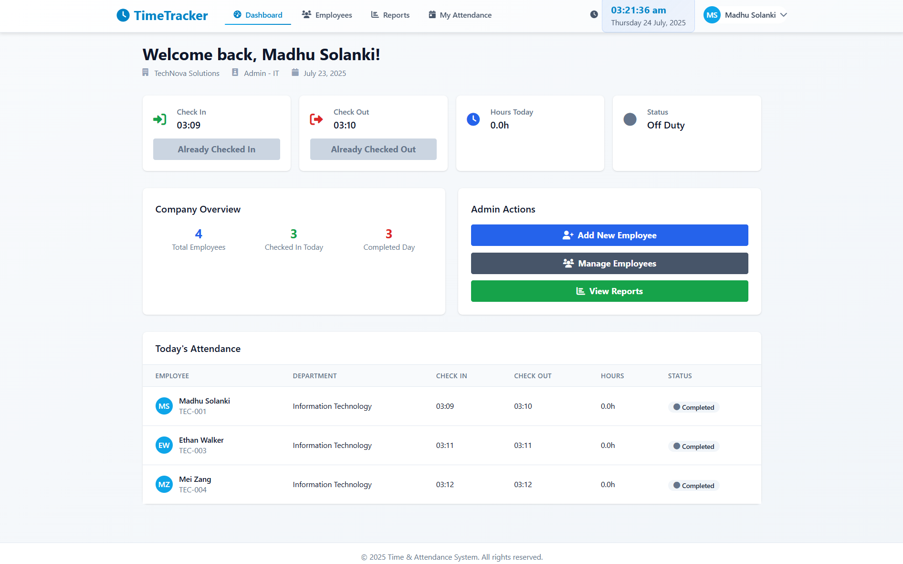
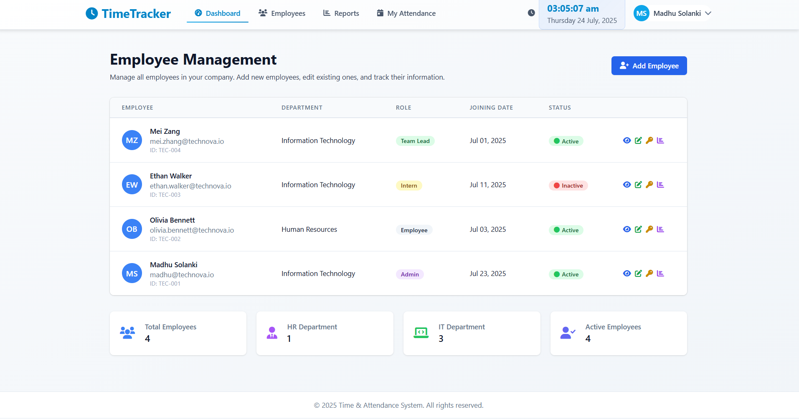
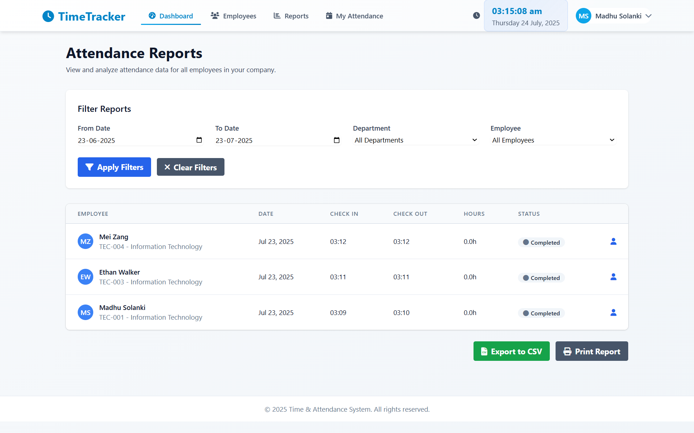
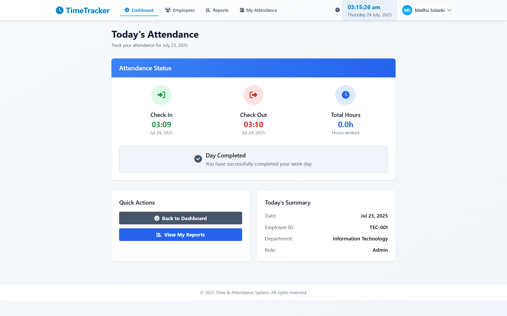
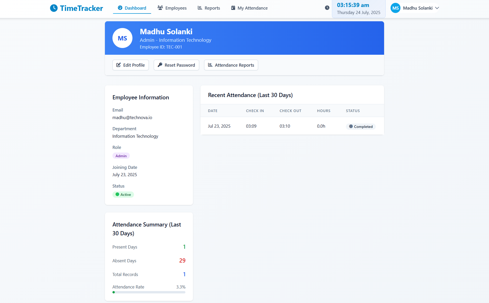

# ⏰ Tymely - Time and Attendance Tracking System

Welcome to Tymely, a time and attendance tracking system built with Django! This project allows companies to manage employees, track attendance, and generate insightful reports with ease. Tymely provides a modern, responsive platform for digital workforce management.

<!-- Demo GIF (add your own if available) -->
<!-- [](https://your-demo-link.com/) -->

## 🛠️ Tech Stack

| Technology | Name |
|------------|------|
|  | HTML5 |
|  | Tailwind CSS |
|  | Django 4.2.7 |
|  | Python 3.x |
|  | SQLite (dev) |
|  | PostgreSQL (prod) |
|  | Git |
|  | GitHub |

## 📁 Project Structure

```
Tymely-Time-and-Attendance-Tracker/
├── attendance_system/      # Django project config
├── companies/              # Company management app
├── employees/              # Employee management app
├── attendance/             # Attendance tracking app
├── templates/              # HTML templates
├── static/                 # CSS, JS, and static files
├── manage.py               # Django management script
├── requirements.txt        # Python dependencies
└── db.sqlite3              # SQLite database (created after migrations)
```

## ✨ Features

- **🔐 Role-Based Access**: Admin, Manager
- **🏢 Company Management**: Register and manage companies
- **👥 Employee Management**: Onboard, edit, and manage employees
- **🕒 Time Tracking**: Daily check-in/check-out with auto time calculation
- **📊 Attendance Reports**: Filter, view, and export reports (CSV)
- **🔄 Real-Time Updates**: Live attendance and status
- **🔑 Password Management**: Admin-controlled password reset
- **🗂️ Department Support**: HR and IT departments
- **🧑‍💼 Employee Profiles**: Detailed info and attendance history

## 📸 Application Pages

### Dashboard
_Overview of your workday and quick actions._



### Employee Management
_Add, edit, and manage employee profiles and roles._



### Attendance Reports
_Admins can generate, filter, and export attendance reports._



### My Attendance
_View and track your daily attendance records._



### My Profile
_Manage your personal and professional details._




## Setup Guide

### Local Development

1. **Clone the repository**
   ```bash
   git clone <repository-url>
   cd Tymely-Time-and-Attendance-Tracker
   ```

2. **Create a virtual environment**
   ```bash
   python -m venv venv
   venv\Scripts\activate  # Windows
   # source venv/bin/activate  # macOS/Linux
   ```

3. **Install dependencies**
   ```bash
   pip install -r requirements.txt
   ```

4. **Set up environment variables**
   Create a `.env` file in the project root with:
   ```
   SECRET_KEY=your_secret_key
   DEBUG=True
   DATABASE_URL=your-database-url
   ALLOWED_HOSTS=your-domain.com
   ```

5. **Run migrations**
   ```bash
   python manage.py makemigrations
   python manage.py migrate
   ```

6. **Create a superuser**
   ```bash
   python manage.py createsuperuser
   ```

7. **Start the development server**
   ```bash
   python manage.py runserver
   ```

8. **Access the application**
   Open http://127.0.0.1:8000/ in your browser

## 🧩 Challenges and Solutions

During development and deployment, you may encounter:
- **Database configuration issues**: Ensure your environment variables and database settings are correct.
- **Static file serving**: Use `python manage.py collectstatic` for production.
- **Role-based access**: Test permissions for each user role.

## 🚀 Future Improvements

- **📈 Advanced Analytics**: Add charts and visualizations for attendance data
- **🔔 Notifications**: Email and real-time notifications
- **📝 Leave Management**: Track and approve leave requests
- **📊Infographics of data analytics**:Shows key attendance trends and stats visually.
- **📈Extension to Django REST APIs**:Provides scalable, API-based access to attendance data.

## 💻 Possible Technical Improvements

- **🧪 Add Testing**: Implement unit and integration tests
- **⚡ Performance**: Optimize queries and static assets
- **🔄 Add CI/CD**: Set up continuous integration and deployment
- **🔌 API Expansion**: Add more endpoints for integrations

---

I hope you enjoy exploring Tymely as much as I enjoyed building it! If you have any questions or suggestions, please feel free to reach out or open an issue on GitHub.

Feel free to create a pull request if you'd like to contribute to Tymely. Thank you for checking out my project! 🙏
